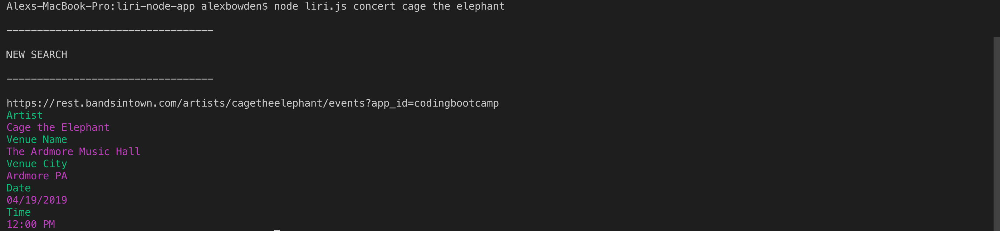
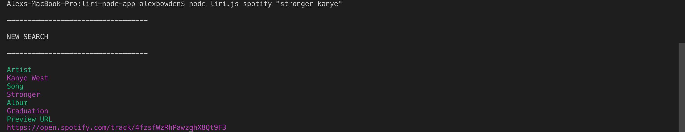
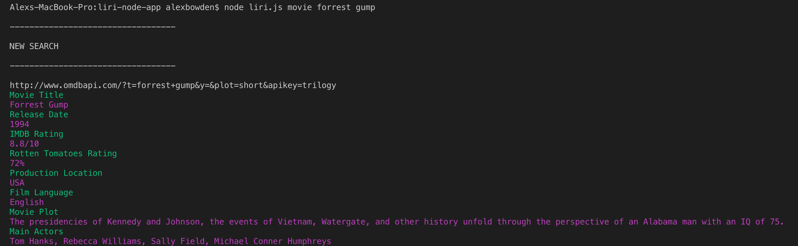
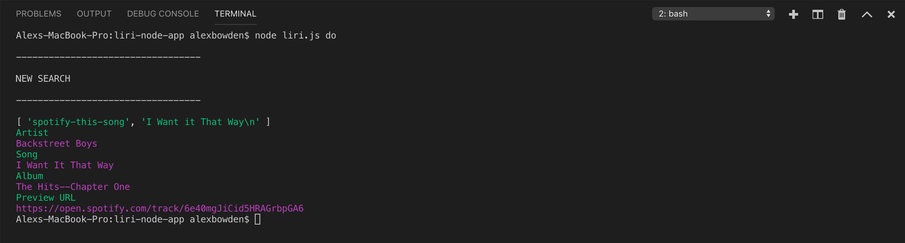

# liri-node-app

**Creator**: `Alex Bowden`

**Created**: `April 15 2019`

- - -

## ABOUT THE APP
LIRI is a _Language_ Interpretation and Recognition Interface. LIRI is a command line node app that takes in parameters and gives you back data. LIRI searches Spotify for songs, Bands in Town for concerts, and OMDB for movies. The `Commands` are:

   * `concert`

   * `spotify`

   * `movie`

   * `do`

- - -
## HOW TO USE LIRI
### **Video Tutorial**

Watch the tutorial video: https://drive.google.com/open?id=19aY8dNDIB-LAJoECms26Ik0iNwnhYaYN

### **Step by Step instructions**

1. Open your terminal through VS code or bash.
2. Find and open the folder containing the `liri.js` file. 
3. Run commands in the terminal under the `liri.js` file. 
3. Results will vary depending on chosen command. 

    **Example 1**: Run the `concert` command
    
        node liri.js concert <artist name>
    
    Output: Once the Bandsintown results are returned, the console will show the next concert for the inputed artist name.

    

    **Example 2**: Run the `spotify` command
    
        node liri.js spotify "<song name>"
    
    Output: The program will return the first search result based on the parameters enered within the quotes. The quotes allow the user to search specifics about a song to find exact results (i.e. "stronger kanye" returns Stronger by Kanye West while "stronger" returns a song from a different artist. The user can then click the preview url to navigate to spotify.

    

    **Example 3**: Run the `movie` command
    
        node liri.js movie-this <movie name>
    
    Output: Once the movie name is entered the system then provides more detailed information about the film from OMDB.

    

    **Example 4**: Run the `do` command
        
        node liri.js do
        
    Output: Calling this function will pull results from the random.txt file, and performs the operation listed. In this case, the operation called is a spotify search for "I Want it That Way".
    
    

- - -

## TECHNOLOGIES USED
* Javascript
* Nodejs
* APIs:
    * Bands in Town
    * OMDB
* Node packages:
    * Node-Spotify-API
    * Request
    * Colors
    * Moment
    * DotEnv
